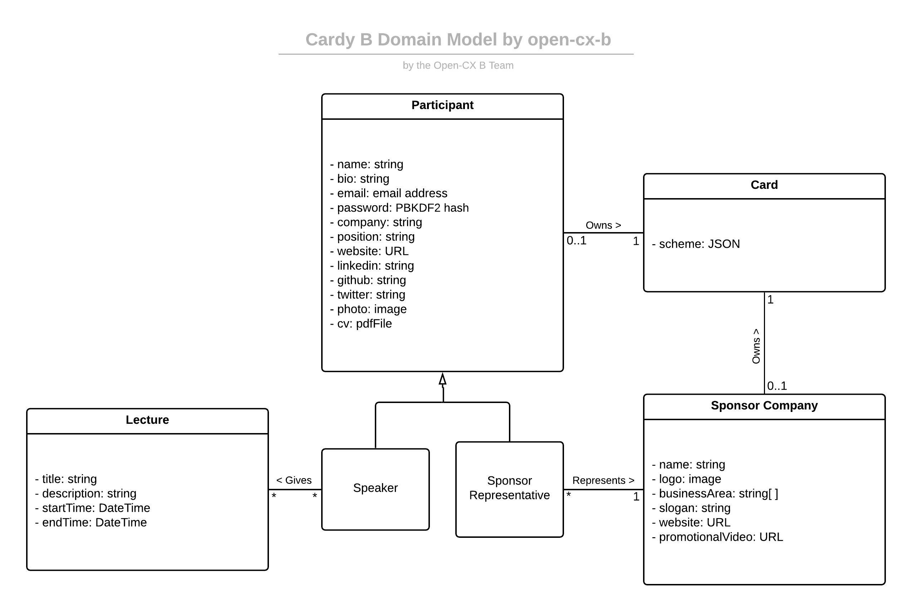

# openCX-*Cardy B* Development Report

Welcome to the documentation pages for *Cardy B* of **openCX**!

You can find here detailed information about the (sub)product, hereby mentioned as module, from a high-level vision to low-level implementation decisions, a kind of Software Development Report (see [template](https://github.com/softeng-feup/open-cx/blob/master/docs/templates/Development-Report.md)), organized by discipline (as of RUP):

* Business modeling
  * [Product Vision](#Product-Vision)
  * [Elevator Pitch](#Elevator-Pitch)
* Requirements
  * [Use Case Diagram](#Use-case-diagram)
  * [User stories](#User-stories)
  * [Domain model](#Domain-model)
* Architecture and Design
  * [Architectural and design decisions]()
  * [Technological architecture]()
  * [Logical architecture]()
* Implementation
  * [Source code]()
  * [Issues](): feature requests, bug fixes, improvements.
* Test
  * [Automated tests](): Functional tests, integration tests, acceptance tests, as much automated as possible.
* Change management
  * [Issues at Github]()
* Project management
  * Tasks management tool

So far, contributions are exclusively made by the initial team, but we hope to open them to the community, in all areas and topics: requirements, technologies, development, experimentation, testing, etc.

Please contact us!

Thank you!

*Eduardo Macedo, João Nuno Matos, João Veiga de Macedo, and José Miguel Simões*

## Product Vision
Often, networking at a conference is a messy and arduous affair. The standard
of business card trading has lost its touch with modern realities, being
cumbersome, expensive and unfriendly to the environment. However, they
represented a solution to the circumstances at hand. They are:

 * Easy to exchange and store
 * Compact and straight to the point
 * A medium to showcase appealing design

What if you could bridge these advantages and modern technologies to have your
cake and eat it too? *Cardy B* aims to do just that.

It is an innovative digital networking system, using the latest in interactive
technologies to provide seamless, paperless networking to the participants of
your conference. With this system in place, your users can:

 * Create their virtual business card, integrated with their social media, CVs,
 or portfolios
 * Have a wallet to store their connections right on their phones/conference
 app/website
 * Exchange information in an intuitive, seamless and convenient way
 * Interacting with smart badges and sponsor stands, making use of the latest
 in NFC and QR technologies
 * Look cool while doing all of it

We understand that sometimes there is an option between interaction and
convenience, but with *Cardy B* you can get them both, you don't need to
choose.

No plan B needed.

## Elevator Pitch
Have you recently been to a conference? How many business cards did you collect?

If I had to hazard a guess, it was a pain in the ass to  store them all, and to follow up on them.

Our new system, Cardy B, is going to solve just that. Just pull out your
smartphone and scan their badge, and you'll get their cards just like that.

\*snap fingers\*

You can also get your card out as a sponsor or speaker and have custom
styling. Want an adventure? Contact us for info.

## Requirements

In this section, you should describe all kinds of requirements for your module: functional and non-functional requirements.

Start by contextualizing your module, describing the main concepts, terms, roles, scope and boundaries of the application domain addressed by the project.

### Use case diagram

#### Attendees
Cardy B's use cases for a conference attendee is to easily make and manage
their connections with other participants of the conference. To that end, they
would have utility for:
  * Facilities to set their profile
  * Design and styling tools for their virtual business card
  * Easy ways to make connections with other participants
  * Ability to perform CRUD operations on their connections

#### Speakers
Cardy B's use cases for a speaker, in addition to those of a normal attendee,
includes the following:
  * Ability to publicise their profile, e.g. as a card, in their presentations

#### Sponsor Representative
As a representative of a sponsor, in addition to all of the above, also needs:
* To set the company's profile, and have a separate card for it.
* To integrate their connections wallet with the sponsor's infrastructure.
* To have a way to collect conections unnatended (e.g. for a sponsor stand)

### User stories

This section will contain the requirements of the product described as **user**
**stories**, organized in a global **user story map** with **user roles** or 
**themes**. They will be added as the project is developed . In the meantime,
if you are in a project oversight position, as the professors are, you can
take a look at our [*Trello* project board](https://trello.com/invite/b/9uMMeBil/f76ed72cb31577e2a3b75704a27ae99e/esof-cardy-%F0%9F%85%B1%EF%B8%8F).

### Domain model

